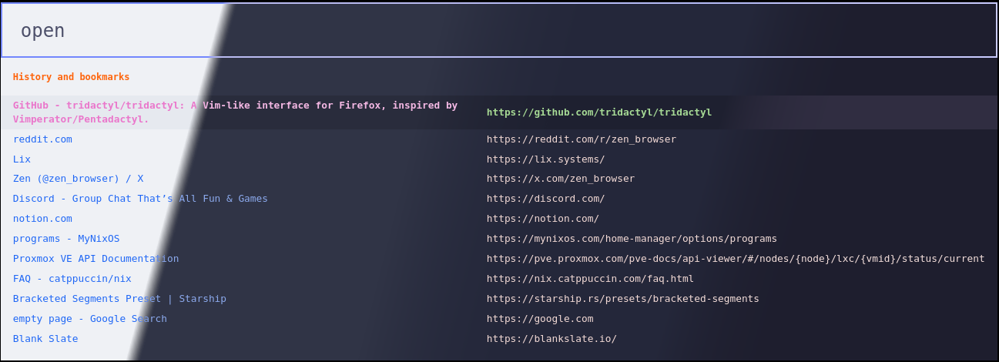
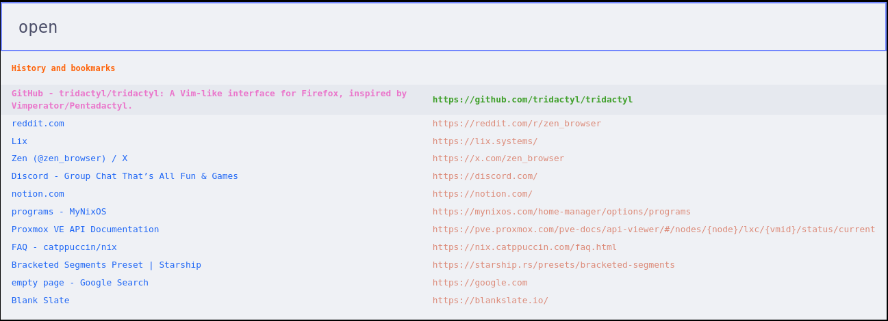
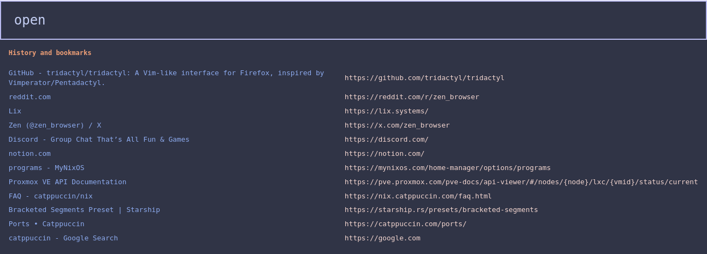
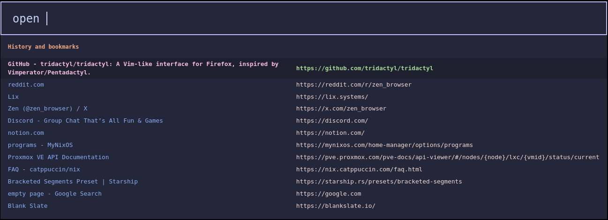
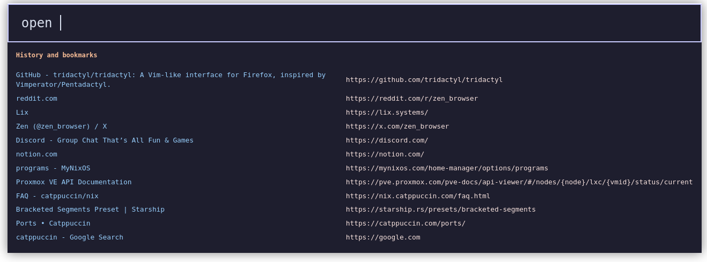

<h3 align="center">
	<br/>
	
	Catppuccin for <a href="https://github.com/tridactyl/tridactyl">Tridactyl</a>
	
</h3>

<p align="center">
  
</p>

## Previews

<details>
<summary>🌻 Latte</summary>
  
</details>
<details>
<summary>🪴 Frappé</summary>
  
</details>
<details>
<summary>🌺 Macchiato</summary>
  
</details>
<details>
<summary>🌿 Mocha</summary>
  
</details>

## Install
`:colourscheme --url https://raw.githubusercontent.com/devnullvoid/catppuccin-tridactyl/main/catppuccin-<flavor>.css catppuccin-<flavor>`

## Customization
- Fork the repo
- Edit CSS vars to change colors/font to your preference
- Use `:colourscheme --url https://raw.githubusercontent.com/<user>/catppuccin-tridactyl/main/catppuccin-<flavor>.css catppuccin-<flavor>_custom` command to set your custom theme

### Example: 

```css
/* Changing color assigned to CSS Variable */
--tridactyl-url-fg: var(--rosewater);
--tridactyl-border: var(--lavender);

/* Change font used throughout */
--font: monospace;

```
- Change `--rosewater` and `--lavender` to the colors you prefer.
- Change `monospace` to your preferred font, i.e. `"Fira Code"`

Available colors correspond to [Catppuccin Palette](https://catppuccin.com/palette): pink, purple, red, etc...


## Thanks
[base16-tridactyl](https://github.com/bezmi/base16-tridactyl)

[Cattpuccin Color Scheme](https://catppuccin.com)
