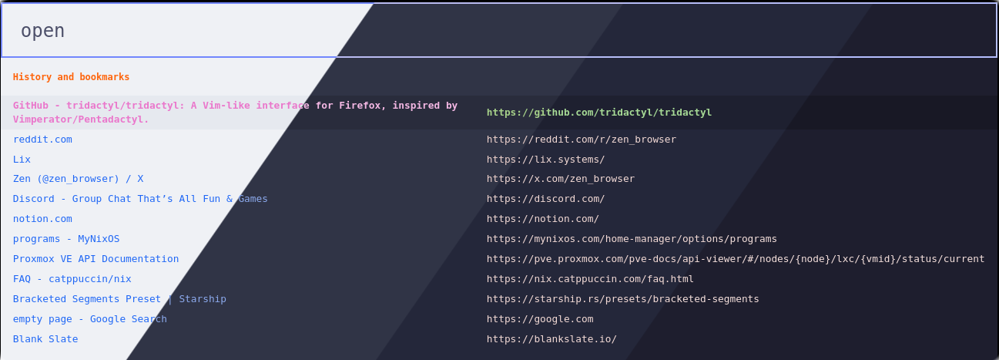
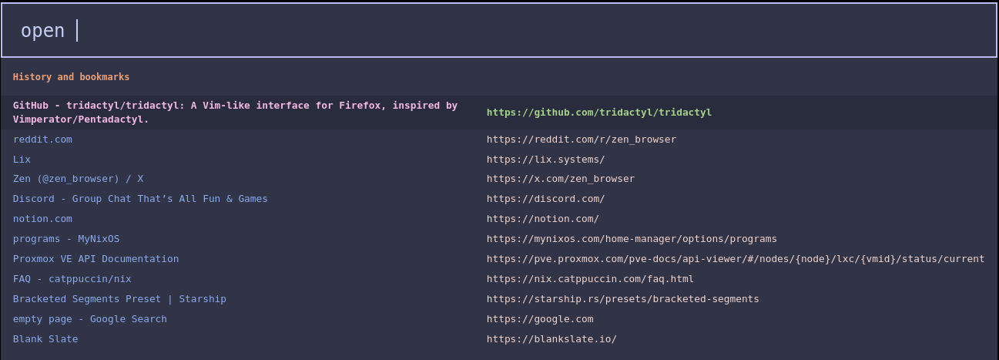
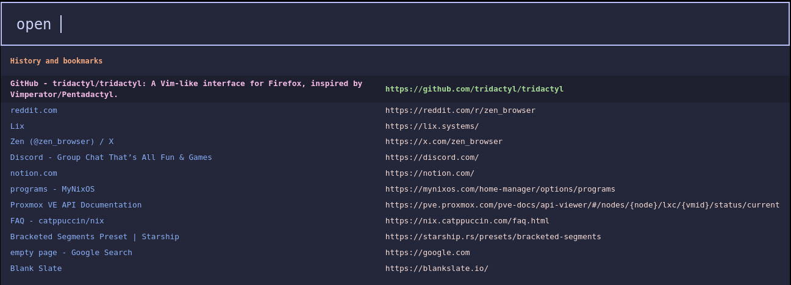

<h3 align="center">
	<br/>
	
	Catppuccin for <a href="https://github.com/tridactyl/tridactyl">Tridactyl</a>
	
</h3>

<p align="center">
	<a href="https://github.com/devnullvoid/tridactyl/stargazers"></a>
	<a href="https://github.com/devnullvoid/tridactyl/issues"></a>
	<a href="https://github.com/devnullvoid/tridactyl/contributors"></a>
</p>

<p align="center">
  
</p>

## Previews

<details>
<summary>🌻 Latte</summary>
  
</details>
<details>
<summary>🪴 Frappé</summary>
  
</details>
<details>
<summary>🌺 Macchiato</summary>
  
</details>
<details>
<summary>🌿 Mocha</summary>
  
</details>

## Usage
To apply a Catppuccin theme to Tridactyl, you'll use the `:colourscheme` command. Replace `<flavor>` with your desired Catppuccin palette: `latte`, `frappe`, `macchiato`, or `mocha`.

For example, to set the **Mocha** theme:

```
:colourscheme --url https://raw.githubusercontent.com/devnullvoid/tridactyl/main/themes/catppuccin-mocha.css catppuccin-mocha
```

Once executed, the theme should apply instantly.

### CLI Alternative Theme

We also provide a **CLI-friendly alternative** based on the default Tridactyl theme but with Catppuccin colors. This theme maintains the familiar look and feel of the original Tridactyl interface while incorporating the beautiful Catppuccin color palette. CLI users will feel right at home with this theme.

To use the CLI version, simply append `-cli` to the filename:

```
:colourscheme --url https://raw.githubusercontent.com/devnullvoid/tridactyl/main/themes/catppuccin-mocha-cli.css catppuccin-mocha-cli
```

The CLI theme is available for all flavors:
- `catppuccin-latte-cli.css`
- `catppuccin-frappe-cli.css`
- `catppuccin-macchiato-cli.css`
- `catppuccin-mocha-cli.css`

---

## Customization

Want to tweak the colors or fonts to perfectly match your setup? It's easy to create your own custom version of the theme.

1.  **Fork the repository:** Start by forking the `devnullvoid/tridactyl` repository on GitHub to your own account.
2.  **Edit the CSS variables:**
    Navigate to the `catppuccin-<flavor>.css` file (e.g., `catppuccin-mocha.css`) within your forked repository. You can edit this file directly on GitHub or clone the repository to your local machine.

    You'll find a set of CSS variables that control the theme's colors and fonts. Feel free to modify them to your liking.

    ### Customization Examples:

    * **Change a specific Tridactyl UI element's color:**
        ```css
        /* Changes the foreground color of the URL in the command line */
        --tridactyl-url-fg: var(--rosewater);
        /* Changes the border color of Tridactyl UI elements */
        --tridactyl-border: var(--lavender);
        ```
        In the examples above, you can replace `var(--rosewater)` or `var(--lavender)` with any of the available Catppuccin colors (e.g., `var(--pink)`, `var(--mauve)`, `var(--red)`, etc.) or even a specific hex code like `#FF0000`.

    * **Change the font used throughout Tridactyl:**
        ```css
        /* Sets the default font to a monospace font */
        --font: monospace;
        ```
        Replace `monospace` with your preferred font. If the font name contains spaces, remember to wrap it in quotes, e.g., `font: "Fira Code";`.

3.  **Apply your custom theme:**
    After saving your changes to the CSS file in your forked repository, use the `:colourscheme` command, but point the `--url` to *your* repository and give your custom theme a unique name (e.g., appending `_custom`):

    ```
    :colourscheme --url [https://raw.githubusercontent.com/](https://raw.githubusercontent.com/)<your-username>/tridactyl/main/themes/catppuccin-<flavor>.css catppuccin-<flavor>_custom
    ```
    Remember to replace `<your-username>` with your GitHub username and `<flavor>` with the base flavor you modified.

## 💝 Thanks to

- [devnullvoid](https://github.com/devnullvoid)

&nbsp;

<p align="center">
	
</p>

<p align="center">
	Copyright &copy; 2021-present <a href="https://github.com/catppuccin" target="_blank">Catppuccin Org</a>
</p>

<p align="center">
	<a href="https://github.com/catppuccin/catppuccin/blob/main/LICENSE"></a>
</p>
